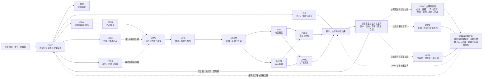
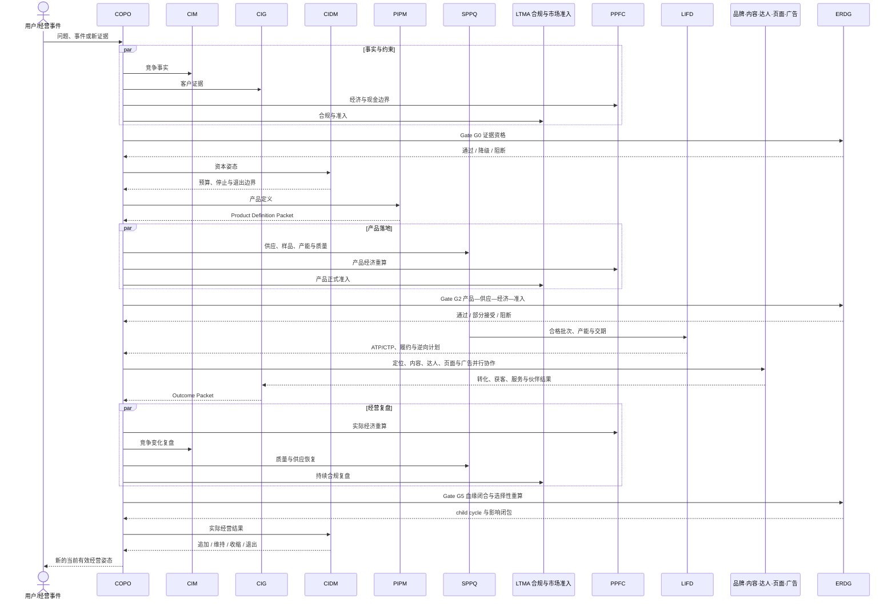
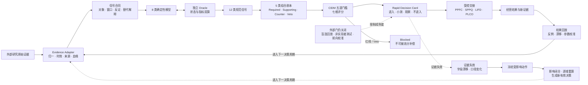

# CrossBorder Decision Lab

[English](README.en.md) · [专业能力](#专业能力) · [决策基础设施](#全局决策基础设施) · [协作架构](#专业能力协作架构) · [使用方式](#如何使用) · [维护规则](RULES.md)

> 面向跨境商业的专业决策基础设施，把依赖个人经验的经营判断转化为有证据、有模型、有边界、有动作、有停止规则、可持续积累的决策资产。

当前统一发布列车：`2026.07`；目标架构：`CBDS-ARCH-2026.07`；共享合同：`ERDG-CONTRACT-2026.07`。

CrossBorder Decision Lab 服务于跨境电商经营者、品牌团队、投资决策者与专业服务团队。它不是一组通用提示词，而是把品类投资、竞争情报、产品、供应采购生产质量、定价财务、履约、页面、广告、达人、内容、营销品牌与客户增长连接成可独立运行、跨域协同和持续进化的专业决策系统。

系统由十四项专业决策能力与三项全局决策基础设施组成：COPO 负责跨域编排，CIDM、CIM、PIPM、SPPQ、LTMA、PPFC、LIFD、MBCM、VLB、CAPM、PLCO、AAMO 与 CIG 分别拥有各自专业主权；ECAE、LCCA 与 ERDG 统一实验因果资格、本地化适用性和治理合同。核心工程与 L1—L3 发布门已经完成，当前成熟度为 `controlled_pilot`。L4 仍需通过真实使用、结果回放、参数校准和独立保证逐步完善；在此之前，不开放真实生产自动决策、高风险用途或外部写入。

## 真实经营使用指引

CrossBorder Decision Lab 的价值来自进入真实的经营工作流，而不是只进行抽象提问或阅读示例。建议使用者把自己的真实经营数据、业务背景、约束条件、已经做过的决策、实际动作与后续结果带入对应能力中，形成完整的“问题—证据—判断—动作—结果—复盘”闭环。数据越完整、过程越连续、结果越可验证，系统越能帮助你发现盲区、复算经济性、校准阈值，并沉淀适合自己的经营基准。

使用真实数据前，请先移除或替换密码、API Key、客户身份信息、订单隐私、未公开财务信息及其他不应外传的敏感内容。当前项目仍处于 `controlled_pilot`，输出应作为决策辅助和复核材料，不应直接替代专业主体判断、审批或高风险经营决策。

如果你在真实使用中遇到问题，有改进建议，或愿意投稿实际案例、数据结构、决策过程与复盘结果，欢迎联系：

- `chensaye1@gmail.com`
- `chensaye1@outlook.com`

## 系统价值与长期壁垒

大模型会持续变强，单次生成内容的成本也会持续下降。真正具有长期价值的不是某一个模型，而是建立在模型之上的专业决策基础设施。

CrossBorder Decision Lab 将跨境经营中分散、隐性的个人经验，转化为可以复用和持续积累的系统能力：

- 把模糊问题拆成明确的决策对象、约束、证据、反事实和责任边界；
- 把“感觉可行”转化为可复算的经济模型、实验方案和行动门槛；
- 把单点分析连接成品类、竞争、内容、客户、广告、供应链、页面、渠道与品牌的协同决策；
- 把成功、失败、异常、停止和退出都纳入同一套经营闭环；
- 把每次使用沉淀为可追溯的判断、动作、结果、修正和业务基准。

系统价值与长期壁垒是同一件事：系统解决的问题越重要，进入真实经营流程越深，积累的决策资产越多，后续决策就越准确、越高效，也越难被简单复制。

```text
专业决策框架与数学模型
            ↓
进入真实跨境经营工作流
            ↓
沉淀“问题—证据—判断—动作—结果”
            ↓
形成国家、平台、品类与生命周期业务基准
            ↓
持续校准模型、门槛、反例与决策路径
            ↓
提升决策质量、协作效率与经营确定性
            ↓
形成数据资产、工作流、专业治理与组织信任壁垒
```

### 为什么它不容易被更强的通用模型替代

通用模型可以理解材料、生成方案和辅助推理，但不会天然拥有一套企业长期积累的：

1. 决策对象和专业主权边界；
2. 历史判断、版本变化与责任链；
3. 国家、平台、品类、价格带和生命周期基准；
4. 成功、失败、异常、停止和退出案例；
5. 业务动作与后续经营结果之间的连续反馈；
6. 跨团队共同使用的证据、计算和审批语言。

模型是可以升级和替换的推理引擎；CrossBorder Decision Lab 保留的是模型之上的专业方法、经营上下文、计算工具、协作协议和持续复利的决策资产。

### 面向长期使用的复利机制

每一次实际使用都会增加系统的长期价值：

- 新问题扩展专业场景覆盖；
- 新证据丰富国家、平台和品类基准；
- 新动作补充经营策略与执行边界；
- 新结果修正参数、门槛和反事实；
- 新失败转化为反例、压力测试和阻断条件；
- 新协作沉淀为可追溯、可复用的组织工作流。

这使系统从“能够回答专业问题”，逐步发展为“能够持续管理专业决策”。

## 系统结构

### 专业能力协作架构



十四项专业能力与 ECAE、LCCA、ERDG 均处于当前受控试点范围。各专业能力保留最终专业主权；ECAE 只裁定实验设计、因果/增量 Claim 资格与证据等级，LCCA 只裁定本地化作用域、动态事实新鲜度、可比性和迁移上限；COPO 只负责编排、冲突升级，以及在各 owner 已批准结论和资源边界内合成协同姿态与安排顺序。它们均不越权批准资本、替代专业结论或执行外部写入。

### 连续经营决策闭环



连续时序只展示跨阶段主链；市场能力组中的五项专业能力仍各自拥有主权，并通过标准 Packet 交接。完整能力注册表位于 [`governance/domain-architecture-registry.json`](governance/domain-architecture-registry.json)。全系统统一使用 v2 交接与 Decision Cycle；旧 v1 运行主链已经退役。

### 一个决策如何形成经营闭环

例如，一家卖家准备评估美国 Amazon 宠物饮水机品类。CIDM 判断是否值得进入及投入边界，CIM 核验竞争变化，CIG 固定客户任务与阻力，PIPM 定义可验证产品，LTMA 限定准入与宣传边界，PPFC 复算价格、利润和现金峰值，SPPQ 与 LIFD 判断供应、批次、库存和履约是否可承诺，MBCM、VLB、CAPM、PLCO 与 AAMO 在各自主权内完成上市与增长协同。

系统不会把一次分析当作最终答案。销量、退货、广告增量、质量、履约和现金结果形成 Outcome Packet；新结果只触发受影响域重算，由对应专业 Owner 决定追加、维持、修正、收缩或退出，并生成下一周期的当前有效经营姿态。

## 专业能力

按“需要做什么决策”选择主 Skill。每个 Skill 的平台覆盖、专业模型、执行流程、输入输出和失败边界，请进入对应目录查看。

| Skill | Runtime | 主要解决的问题 | 专业入口 |
|---|---|---|---|
| **CIDM** | `CIDM-2026.07` + `OSL-v1` | 什么值得进入、投资、测试、放量、收缩或退出？外部信号只生成受治理候选。 | [品类投资决策](category-investment-decision/SKILL.md) |
| **CIM** | `CIM-2026.07` | 竞品是谁、发生了什么变化、为什么重要、如何响应？ | [竞品情报监控](competitive-intelligence-monitoring/SKILL.md) |
| **VLB** | `VLB-2026.07` | 内容为什么有效、能否迁移、如何生产、测试和规模化？ | [内容创意与传播](video-link-breakdown/SKILL.md) |
| **CIG** | `CIG-2026.07` | 客户是谁、需求和阻力是什么、什么是真增量、如何增长？ | [消费者洞察与客户增长](consumer-insights-customer-growth/SKILL.md) |
| **AAMO** | `AAMO-2026.07` | 广告能否投、问题在哪里、真实增量多少、如何配置和停止？ | [广告分析、测量与优化](advertising-analysis-measurement-optimization/SKILL.md) |
| **LIFD** | `LIFD-2026.07` | 走什么路线和仓、何时补货、库存怎么分、如何履约和退出？ | [物流、库存与履约](logistics-inventory-fulfillment-decision/SKILL.md) |
| **PLCO** | `PLCO-2026.07` | 店铺和页面能否承接，标题、主图、详情或落地页具体怎么改？ | [平台、店铺与转化](platform-store-listing-conversion/SKILL.md) |
| **CAPM** | `CAPM-2026.07` | 找谁合作、如何报价、寄样、签约、购买权利、经营联盟和退出？ | [达人与联盟经营](creator-affiliate-partnership-management/SKILL.md) |
| **MBCM** | `MBCM-2026.07` | 如何分层、定位、上市、建设品牌、组织活动和编排营销资源？ | [营销、品牌与活动](marketing-brand-campaign-management/SKILL.md) |
| **PPFC** | `PPFC-2026.07` | 售价、利润、贡献、保本指标、财务约束和现金风险应该如何计算与调整？ | [定价、利润、财务与现金流](pricing-profit-finance-cashflow-decision/SKILL.md) |
| **PIPM** | `PIPM-2026.07` | 产品机会如何转化为可验证的产品定义、规格、MVP和路线图？ | [产品创新与产品管理](product-innovation-product-management/SKILL.md) |
| **SPPQ** | `SPPQ-2026.07` | 供应商是否可信、采购能否承诺、生产和批次是否可以放行、事故如何恢复？ | [供应商、采购、生产与质量](supplier-procurement-production-quality-decision/SKILL.md) |
| **LTMA** | `LTMA-2026.07` | 当前证据下能否继续商业准备，哪些动作须阻断、补证或交适格专业主体复核？ | [法律、税务、IP 与市场准入](legal-tax-intellectual-property-market-access-decision/SKILL.md) |
| **COPO** | `COPO-2026.07` | 多域问题如何诊断、升级冲突、合成 owner 已批准的经营姿态并安排依赖顺序？ | [跨域经营姿态与决策编排](cross-domain-operating-posture-orchestration/SKILL.md) |

共享底座不拥有业务最终决策主权：

| 基础设施 | Runtime | 主要解决的问题 | 专业入口 |
|---|---|---|---|
| **ECAE** | `ECAE` · `controlled_pilot` | 实验是否可执行、因果量是否可识别、结果可声称到什么等级、何时必须降级或重做？ | [实验与因果评估](experiment-causal-assessment/SKILL.md) |
| **LCCA** | `LCCA-2026.07` · `controlled_pilot` | 事实是否适用于目标市场和时点、口径是否可比、参数如何转换、跨市场结论最多能迁移到什么程度？ | [本地化与国家校准](localization-country-calibration/SKILL.md) |

## 全局决策基础设施

十四项专业能力通过 [`ERDG-CONTRACT-2026.07`](governance/erdg/ERDG.md) 共享底层决策原则；[ECAE](experiment-causal-assessment/SKILL.md) 统一实验协议、估计量、CE0—CE5 证据等级、诊断、复现和因果 Claim 上限；[LCCA](localization-country-calibration/SKILL.md) 统一作用域、动态事实、币税单位时区转换、可比性和迁移等级。ERDG 负责结构安全、确定性公共计算和跨域合同校验；各专业能力继续拥有自己的模型、阈值与最终业务决策。

模型交互前由 [`Prompt Intake Guard`](governance/interaction/interaction-governance.md) 把请求路由为回答、补数、研究、计算或阻断；ERDG 通过后的 Decision Packet 才能编译为面向运营的 Operator Playbook。动态平台知识使用带来源、证据等级、复核日和失效条件的 [平台知识卡](governance/platform-knowledge/platform-knowledge-contract.md)；外部数据按 [Connector 合同](governance/connectors/connector-governance.md) 接入，当前均为只读合同，不授权外部写入。

1. **证据与反证**：观察、用户输入、授权数据、外部基准、推断和假设分开记录。
2. **数学与守恒**：利润、增量、容量、组合和风险通过可复算模型计算。
3. **专业主权**：资本、广告、客户、页面、履约、内容、伙伴和品牌结论不互相越权。
4. **版本与血缘**：对象、证据、计算、结论和动作均保留版本与来源。
5. **连续追问**：新信息只重算受影响部分，不静默覆盖历史判断。
6. **动作闭环**：每个结论绑定责任人、资源、观察窗、成功条件、停止和回滚。
7. **失败治理**：缺失、冲突、污染、异常、事故、收缩和退出均有明确处理路径。
8. **长期校准**：随着持续使用，逐步形成适配国家、平台、品类和生命周期的经营基准。

## 当前能力

当前版本已经形成十四项可独立运行、可跨域联动的专业决策能力，并完成：

- 专业场景与生命周期覆盖；
- 确定性经济模型与统计估计工具；
- 单 Skill、跨 Skill 和连续追问执行；
- 极端组合、冲突、缺失、失败和压力测试；
- 证据、计算、结论、动作和版本血缘；
- 专业主权、风险红线、停止、回滚与退出治理；
- 仓库级自动化校验和发布门禁。

| 证据维度 | 当前状态 | 能证明什么 | 不能证明什么 |
|---|---:|---|---|
| 专业能力 | 14 个域 | 专业主权、独立运行与跨域合同 | 不等于真实经营效果 |
| 全局基础设施 | ERDG、ECAE、LCCA | 治理、因果资格和本地化适用性 | 不拥有业务最终决策权 |
| 规范化评测 | 835 个源案例 | 场景、异常和语义覆盖 | 不等于 835 个真实经营案例 |
| 专业验证 | 33 个入口 | 语义校验与数值复算可执行 | 不等于生产成熟 |
| 防篡改验证 | 12 类突变 | 关键守卫不能被静默删除或放宽 | 不替代外部独立保证 |
| 当前成熟度 | `controlled_pilot` | L1—L3 工程门完成，可受控试点 | 不授权生产自动决策、高风险用途或外部写入 |

专业工程门以 [`governance/professional-engineering-release.md`](governance/professional-engineering-release.md) 为统一口径。ECAE 与 LCCA 均已完成独立 L1—L3 受控试点门和 13/13 消费者合同接受；本地 fixture 和只读预检不构成生产证据。运行总发布校验可复算当前状态；L4 的生产双跑、真实结果校准、外部资格和非实现者独立复核单独管理。

系统不依赖固定的大模型供应商。模型可以持续升级，专业决策合同、计算工具、业务基准和历史资产保持连续。

## 重点能力更新：OSL-v1

CIDM 现包含受治理的 `OSL-v1` 机会信号层：以 clean-room 方式把外部研究启发归并为八类确定性候选信号，覆盖多源字段质量、五类组合剧本、有效供给/VOC、CIDM→PLCO Proof 交接、部分失败 DAG、R0–R4 恢复、独立 Oracle 和 13 项源码 mutation。该信号层只扩大候选池，不能直接改变七维评分、资本姿态或跨域主权；授权 20 例盲选回放、20 人非实现者理解测试和前向校准仍未完成，因此不构成生产成熟度声明。



这张图展示的是“候选发现如何受治理”，不是另一套投资评分器。红线、否决条件或证据失效优先阻断并触发恢复；信号层无权直接批准投资、备货、页面或广告动作。

## 如何使用

### 1. 直接描述决策问题

例如：

- “这个品类是否值得进入美国 Amazon？”
- “竞品最近为什么突然增长？”
- “这条视频为什么有效，适不适合我的产品？”
- “这批客户为什么没有复购？”
- “广告有订单但没有利润，应该怎么处理？”
- “现在应该补多少库存、走哪个仓？”
- “这个 Listing 的主图和详情页具体怎么改？”
- “这个达人值不值得寄样和签约？”
- “新品应该如何定位、上市和组织营销活动？”
- “不同平台费率和陆海空运成本变化后，售价、利润和保本 ROAS 应该是多少？”

### 2. 由主 Skill 完成专业判断

主 Skill 固定对象、证据、约束和决策目标，调用相应模型并输出行动、成功条件、停止规则和需要承接的其他专业域。

### 3. 按需进行跨 Skill 联动

复杂问题可以由多个 Skill 交换经过版本化的证据和约束，但最终结论仍由拥有该决策主权的 Skill 给出。

### 4. 持续回填与校准

实际动作和经营结果回填后，系统更新业务基准、参数、反例和下一阶段决策。

## 仓库导航

| 位置 | 内容 |
|---|---|
| 十四个专业 Skill 目录 | 各专业域的入口、工作流、模型、参考资料和测试 |
| [`evaluations/`](evaluations/) | 单 Skill、跨 Skill、连续追问、对抗与极端场景 |
| [`governance/`](governance/) | 主权、成熟度、变更影响与共享治理合同 |
| [`governance/erdg/`](governance/erdg/ERDG.md) | ERDG 经济、风险、证据、状态、参数、血缘与跨域决策治理底座 |
| [`experiment-causal-assessment/`](experiment-causal-assessment/SKILL.md) | ECAE 实验设计、因果资格、证据分级、诊断、复现、消费者接受与 L4 预留门 |
| [`localization-country-calibration/`](localization-country-calibration/SKILL.md) | LCCA 本地化作用域、动态事实、确定性转换、可比性、迁移等级、消费者接受与 L4 预留门 |
| [`governance/foundation-capability-registry.json`](governance/foundation-capability-registry.json) | ECAE/LCCA 共享底座身份、能力、消费者、主权和成熟度 |
| [`governance/interaction/`](governance/interaction/interaction-governance.md) | Prompt Intake Guard 与 Decision Packet → Operator Playbook 编译控制 |
| [`governance/platform-knowledge/`](governance/platform-knowledge/platform-knowledge-contract.md) | PLCO、AAMO、LIFD 的版本化平台知识卡与失效门 |
| [`governance/connectors/`](governance/connectors/connector-governance.md) | SP-API、Seller Central、广告与 ERP 的只读证据接口和 Action Gateway |
| [`scripts/`](scripts/) | 全仓校验、质量评分、集成与发布门禁 |
| [`.github/workflows/expert-release.yml`](.github/workflows/expert-release.yml) | 自动化发布质量门 |
| [`requirements-dev.txt`](requirements-dev.txt) | 本地与自动化校验使用的锁定依赖 |
| [`RULES.md`](RULES.md) | 仓库维护、版本、测试和发布规则 |

## 质量与安全边界

- 动态平台规则、法规、价格和市场事实在执行时按日期核验。
- 平台归因、相关性、预测和因果增量保持严格区分。
- L4 未关闭前，真实生产决策、高风险用途、自动执行和外部写入必须失败关闭；合成或只读预检不得冒充生产证据。
- 财务结论区分事实、用户输入、外部基准和情景假设。
- 法律、税务、知识产权和监管事项保留适格专业主权。
- 系统不支持虚假互动、欺骗性宣传、侵权、刷评或规避平台规则。
- 内容迁移聚焦可转移机制和测试逻辑，不复制受保护表达。

## Copyright

Copyright © 2026 Miles Chen. All rights reserved.

CrossBorder Decision Lab / 出海决策实验室及其原创决策框架、评分模型、工作流、文档和代码受版权保护。未经版权所有者事先书面许可，不得复制、修改、分发、转授权、销售、商业使用或基于本仓库内容制作衍生作品。详见 [LICENSE](LICENSE)。
